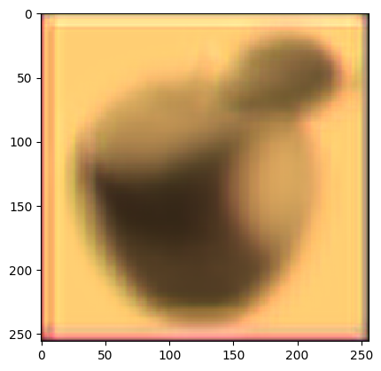
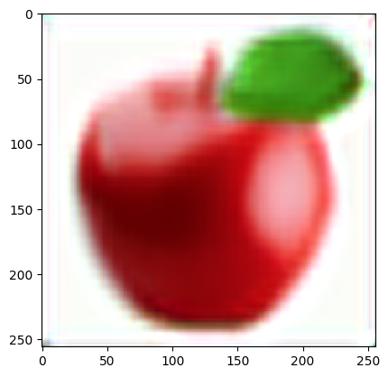
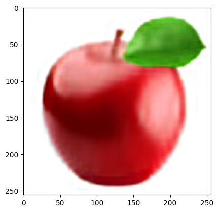

# Advanced Image Reconstruction Autoencoders

This project explores advanced image reconstruction techniques utilizing autoencoder neural networks. Autoencoders are a type of artificial neural network particularly useful for unsupervised learning tasks like dimensionality reduction and data compression.

### Overview

Autoencoders typically consist of an encoder and a decoder. The encoder compresses input data into a latent-space representation, while the decoder reconstructs the original input from this representation. In this project, we employ a convolutional autoencoder architecture for image reconstruction tasks.

### Model Architecture

The autoencoder model architecture comprises several convolutional layers for feature extraction and upsampling layers for image reconstruction.

1. **Convolutional Layers**:
   - The model starts with a convolutional layer with 64 filters and a kernel size of (3,3), followed by ReLU activation and same padding. This layer extracts features from the input image.
   - Subsequent convolutional layers with decreasing filter sizes (32, 16) continue to extract more abstract features from the input.
   - Each convolutional layer is followed by a max-pooling layer with a pooling size of (2,2) and same padding, which reduces the spatial dimensions of the feature maps.

2. **Upsampling Layers**:
   - After the feature extraction phase, the model uses upsampling layers to reconstruct the input image from the extracted features.
   - The upsampling layers consist of convolutional layers with increasing filter sizes (16, 32, 64) to upsample the feature maps and gradually reconstruct the image.
   - Each upsampling layer is followed by a 2x2 upsampling operation to increase the spatial dimensions of the feature maps.

3. **Output Layer**:
   - The final convolutional layer consists of 3 filters and a kernel size of (3,3) with ReLU activation and same padding. This layer reconstructs the RGB image from the feature maps obtained from the upsampling layers.

4. **Compilation**:
   - The model is compiled with the Adam optimizer and mean squared error loss function for training.

### Training

The model is trained using mean squared error loss and the Adam optimizer. We train the model for various numbers of epochs to observe the impact of training duration on image reconstruction quality.

### Comparative Analysis

We conducted experiments with different numbers of epochs to analyze the model's performance. Here are the key findings:

**Original Image**:

  

- **10 Epochs**: With minimal training, the reconstructed images show basic features but lack fine details and clarity.
  
  

- **100 Epochs**: After increasing the training duration, the reconstructed images exhibit improved clarity and better preservation of image details compared to 10 epochs.
  
  

- **500 Epochs**: Further training enhances the reconstruction quality, resulting in sharper images with more accurate color representation and finer details.
  
  
  
- **1000 Epochs**: At this stage, the reconstructed images closely resemble the original inputs, with significantly improved clarity, color fidelity, and detail preservation.
  
  
  
- **2000 Epochs**: With extended training, the model continues to refine its reconstruction capabilities. The images reconstructed at this stage are highly faithful to the originals, with minimal distortion and accurate representation of fine details.
  
  
  
### Conclusion

The experiments demonstrate the effectiveness of convolutional autoencoders for image reconstruction tasks. Increasing the number of training epochs significantly improves reconstruction quality, leading to sharper, more faithful reconstructions. The findings highlight the importance of training duration in optimizing autoencoder performance for image processing applications.
